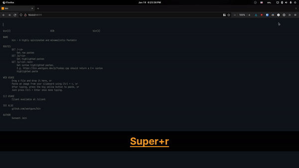
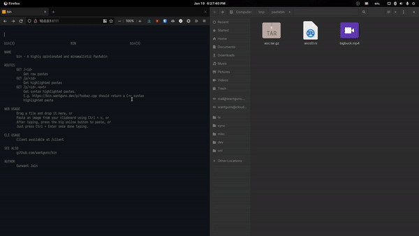

# Bin 
A minimal pastebin which also accepts binary files like Images, PDFs and ships
multiple clients.

It does not require you to host a SQL server and everything is self-contained in
a statically linked binary, which makes it extremely easy to deploy.

## Clients

### Web

You can paste

- Normal Text

- Paste Images from clipboard:  


- Files by drag and drop:  


### CLI

[](https://asciinema.org/a/khcEtveMAbjqJccySdmWuPe1l)

#### Installation

Get the client from [this repository](contrib/cli/client) or from my deployed paste:

```bash
curl -o pst https://bin.noracodes.dev/r/client && chmod +x pst
```

or manually copy the following at a file in your path.

```bash
#!/bin/bash

# Change the url accordingly
URL="https://bin.nora.codes"

FILEPATH="$1"
FILENAME=$(basename -- "$FILEPATH")
EXTENSION="${FILENAME##*.}"

RESPONSE=$(curl --data-binary @${FILEPATH:-/dev/stdin} --url $URL)
PASTELINK="$URL$RESPONSE"

[ -z "$EXTENSION" ] && \
    echo "$PASTELINK" || \
    echo "$PASTELINK.$EXTENSION"
```

You have the option to remove the `/client` description / help in the
landing page. To show the `/client` description, run the `bin` binary
with either `BIN_CLIENT_DESC` env variable or a `-c` flag. More on
arguments later

#### Usage

It just works.

```bash
$ pst somefile.txt
$ cat someimage.png | pst
```

### (Neo)Vim

#### Installation

1. Install the CLI client
2. Append this to your init.vim / vimrc

```vim
nnoremap <leader>p :!pst %<CR>
```
#### Usage

Use `<leader> + p` paste.

## Server Deployment

The [main fork](https://github.com/wantguns/bin) ships Docker and binary releases.

### Manual

- Build on your own:
```bash
# A statically linked build
$ cargo build --release
```

- Execute the binary as is, no extra shenanigans needed:
```bash
$ ./bin
```

#### Usage

```txt
USAGE:
    bin [OPTIONS]

OPTIONS:
    -a, --address <ADDRESS>
            Address on which the webserver runs [default: 127.0.0.1]

    -b, --binary-upload-limit <BINARY_UPLOAD_LIMIT>
            Binary uploads file size limit (in MiB) [default: 100]

    -c, --client-desc
            Include client description [env: CLIENT_DESC=]

    -h, --help
            Print help information

    -p, --port <PORT>
            Port on which the webserver runs [default: 6162]

    -u, --upload <UPLOAD>
            Path to the uploads folder [default: ./upload]

    -V, --version
            Print version information
```

#### Configuration

This pastebin utilizes a custom configuration provider from Rocket. Apart from
the essential arguments, you can also use environment variables, which have the
highest preference in order.

Everything from the [official Rocket
doc](https://rocket.rs/v0.5-rc/guide/configuration/#overview) is supported,
just that you have to prefix the env variable with "BIN_":
```txt
BIN_PORT=6163
BIN_ADDRESS=0.0.0.0
BIN_LIMITS={form="16 MiB"}
BIN_WORKERS=8
BIN_IDENT=false
...
```

## API

`GET /r/<id>[.<ext>]`
  Get raw pastes

`GET /p/<id>`  
  Get pastes with a pretty UI

`GET /p/<id>.<ext> `  

  Get syntax highlighted pastes in the pretty UI.
  E.g. https://bin.nora.codes/p/foobaz.cpp should return a C++ syntax
  highlighted paste

`POST /`
  Post binary data, get object ID

## Design Decisions

This pastebin: 

- does not use a database. It lacks non-essential features like
  password-protection / automatic deletion as a result of which, it can do
  completely fine with flat filesystems. As an upside (opinionated), it makes
  deploying it easier.
- uses server sided highlighting, which ensures that everything stays light and
  snappy at the client side.
- uses very minimal frontend because a pastebin does not need it. It focuses
  (or atleast tries to) on getting things done in minimum amount of clicks.

## Hacking

- If you want to ensure your pushed refs will pass CI, add the prepush script
  to your Git hooks:

  ```bash
  $ cp -a tools/prepush .git/hooks/pre-push
  ```

  Alternately, just run `./tools/prepush` yourself before pushing.

- The Cargo configuration for this project is set for statically compiled
  builds. You can check out the [config file](.cargo/config.toml) to know more.
- Read the [buildci](.github/workflows/buildci.yml) to know how the project is
  statically compiled for two architectures.
